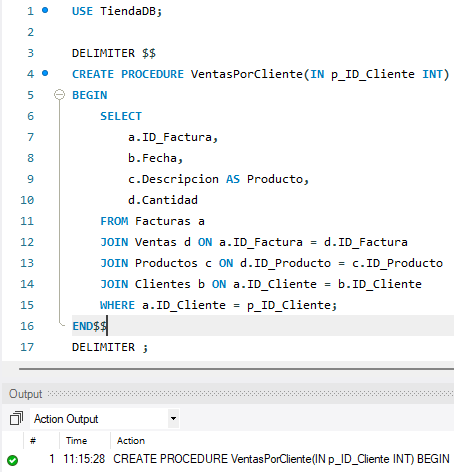
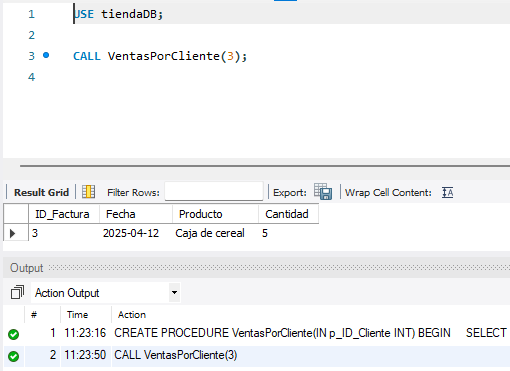
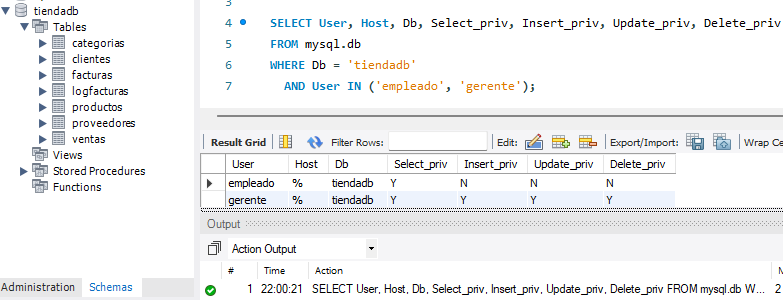
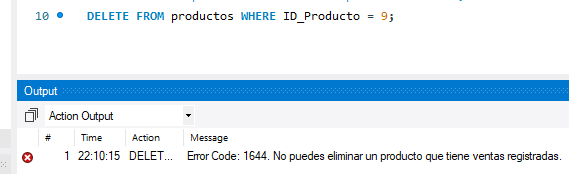

# Diseño e Implementación de un Esquema Relacional en MySQL

Este repositorio contiene el desarrollo de una base de datos para una tienda, que incluye creación de entidades, relaciones, procedimientos almacenados, triggers, control de acceso, y más.

---

## 📌 Diagrama de Base de Datos

---

## 🛠️ Creación de la Base de Datos y Tablas

<strong>Ver pasos de creación</strong>

- Creación de la base de datos  
  

- Mostrar bases de datos existentes  
  

- Ejemplo de creación de tabla (clientes)  
  

- Todas las tablas creadas  
  

---

## 📥 Inserción y Verificación de Datos

- Inserción de datos  
  

- Verificación de datos ingresados  
  

---

## ⚙️ Procedimientos Almacenados

- Creación de procedimientos almacenados  
  

- Uso de los procedimientos  
  

---

## 🔐 Control de Acceso y Usuarios

- Verificación de usuarios con acceso a la base de datos  
  

---

## 🚨 Triggers

- Ejemplo de trigger creado en la base de datos  
  

---

## 🎥 Video Explicativo

<!-- > Próximamente se incluirá un video demostrativo donde se ejecuta y valida cada punto del desarrollo. -->

<!-- --- -->

<!-- ¿Te gustaría que agregue una tabla de contenido o algún badge (como licencia, versión, etc.)? -->
